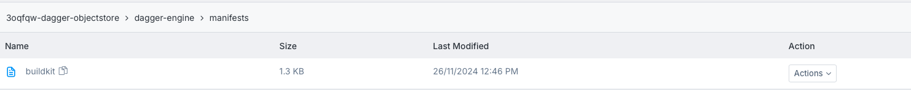

# Dagger Civo Infrastructure

This repo provides infrastucture to run Dagger jobs using a Civo managed
kubernetes cluster for compute and Civo Object Storage as a dagger cache.

# Setup

```bash
cd terraform
terraform init
terraform apply
export KUBECONFIG=$(pwd)/kubeconfig
kubectl get nodes
cd ..
```

# Dagger

```bash
DAGGER_ENGINE_POD_NAME="$(kubectl get pod \
    --selector=name=dagger-dagger-helm-engine --namespace=dagger \
    --output=jsonpath='{.items[0].metadata.name}')"
export DAGGER_ENGINE_POD_NAME
echo $DAGGER_ENGINE_POD_NAME

_EXPERIMENTAL_DAGGER_RUNNER_HOST="kube-pod://$DAGGER_ENGINE_POD_NAME?namespace=dagger"
export _EXPERIMENTAL_DAGGER_RUNNER_HOST
echo $_EXPERIMENTAL_DAGGER_RUNNER_HOST
dagger query <<EOF
{
    container {
        from(address:"alpine") {
            withExec(args: ["uname", "-a"]) { stdout }
        }
    }
}
EOF
```

# Dagger Cache

View the cache bucket in the Civo Object Storage dashboard.



References:

- https://docs.dagger.io/integrations/kubernetes/

